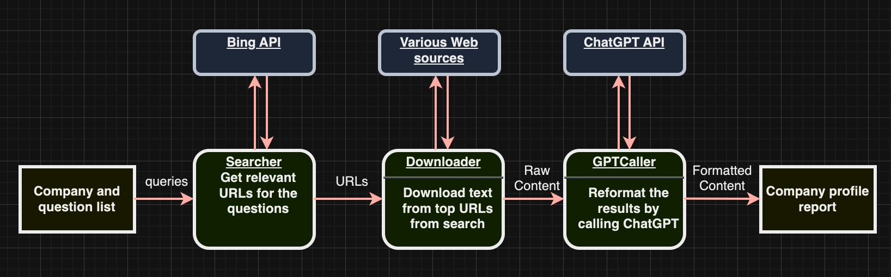

# Anabot
Anabot is a collection of experimental tools to perform automated research and analysis. 

# Disclaimer
The information provided by this tool is just for recreational usages and may not be accurate or suitable for all situations.

# How to run
Create your own OpenAI api key at https://platform.openai.com/, after you got the key, set it as the OPENAI_API_KEY environment variable in the [run_anabot.sh](run_anabot.sh).
Create your own Azure Ocp-Apim-Subscription-Key at https://portal.azure.com/#home, after you got the key, set it as the AZURE_API_KEY environment variable in the [run_anabot.sh](run_anabot.sh)
Then in project directory, run `./run_anabot.sh`

# How to contribute
